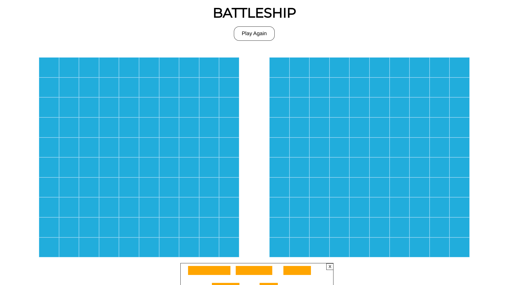
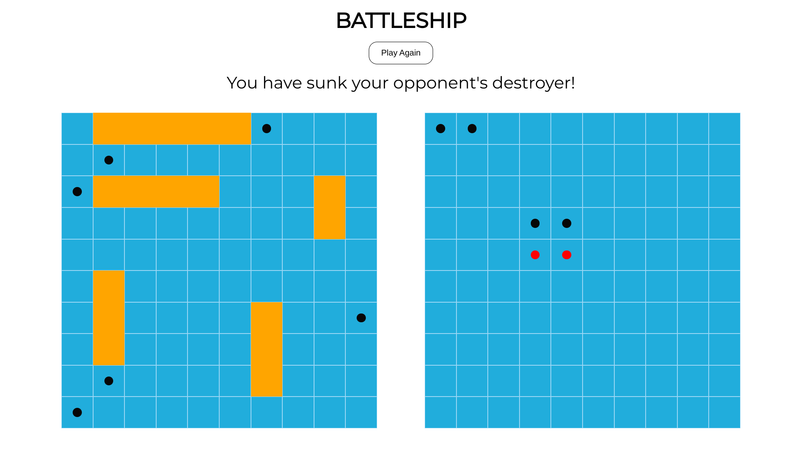
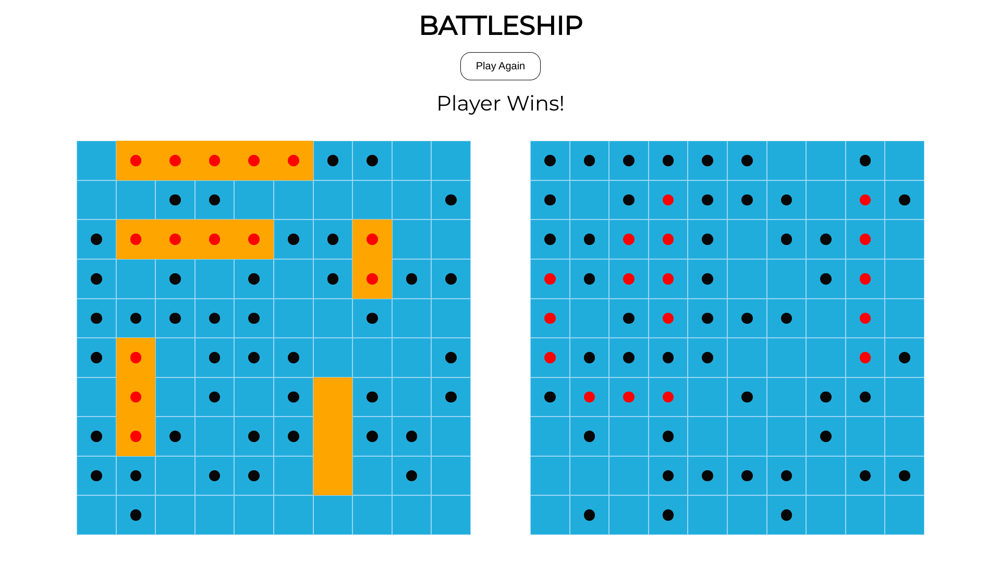

# battleship

Link to game: https://itsaflamingo.github.io/battleship/

Assignment instructions: https://www.theodinproject.com/lessons/node-path-javascript-battleship

Overview: 
1. Ships are created using the ship factory function, and player & computer ships are placed into an array. Computer ships come with pre-set coordinates, whereas player ships must be placed by the user. Player ship coordinates are set after they are placed, within the dropHandler function using pubSub's 'publish' handler. 
2. Once ships have been placed, alterShipSection().isFinished() is executed, which removes the div from which the ships are dragged from the UI. It also executes function sendLocationsToPlayer() via pub-sub's 'publish', which sends player coordinates to GameBoard and Player functions. This ensures that they are not called twice, allowing them to save state each time a method is called, so only their methods alter their state, not an outside function. 
3. When clicked, the div's id is sent to the Player factory function, which switches between player and computer. Player's hit on the computer registers, followed by the computer's hit on the player board. This was by far the most complicated aspect of the program to write, particularly the computer's smart choice algorithm, which operates as a human would when a boat is hit, as it will generate hits around the clicked div until another hit is found, and continue in that direction. On each boat hit, the program will check if the boat has been sunk. If boat is not hit, the computer generates a random number from 1-100, corresponding to the number of divs on the board. For each hit on the board, the ship's object keeps track of all the places it has been hit & whether or not it has been sunk.
4. Once boat is sunk, the program returns to generating hits randomly, until it hits another. At the end of each sunk ship, the game checks whether the number of ships sunk is equal to 5, which will end the game. 

Design: 
I used the publisher-subscriber (or pub-sub) pattern as an intermediary between the logical & DOM components. 
I use factory functions throughout the game, and I find them easy to read/understand, and a good pattern to allow functions to access methods. I would like to play with constructor functions & classes in the future, but from past experience factory functions are simple & accessible. 
I decided to place all initialization and subscriptions in one single page, index.js, to increase modularity and prevent the testing suite from being polluted with DOM methods and queries, as testing of the DOM will be taught in future lessons.
I placed the majority of DOM methods in display.js, and the majority of logic is placed within gameboard, ship, and player functions. 

Challenges: 
The program could have been much more modular. I could have done a better job of following the single responsibility principle, which would have made testing much easier. The most difficult parts of writing this program were writing tests and making the computer choice algorithm work for all edge cases. I wish I had at least roughly planned out the program before-hand, and also written tests before writing functions.

